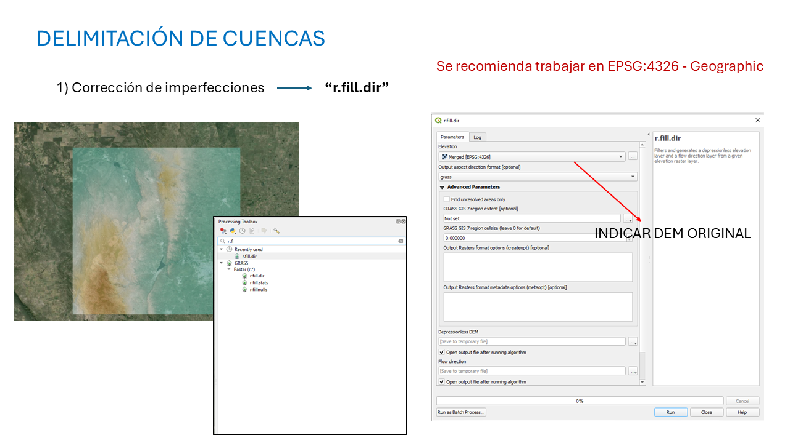
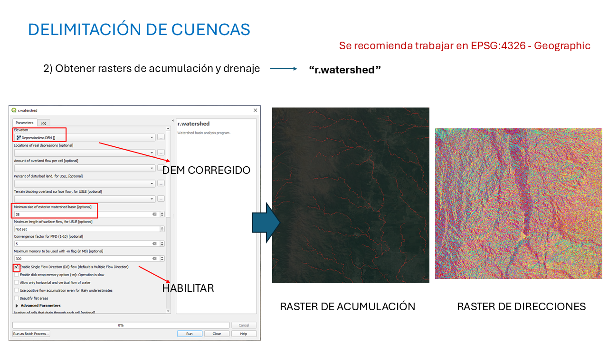
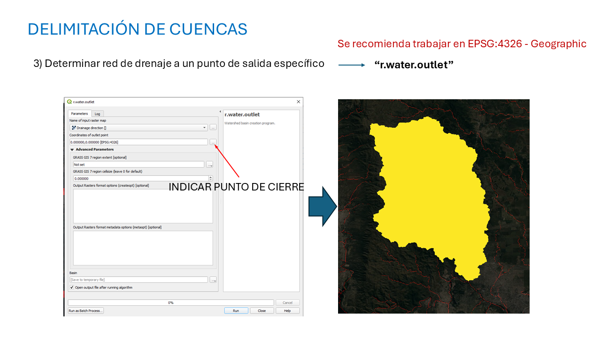
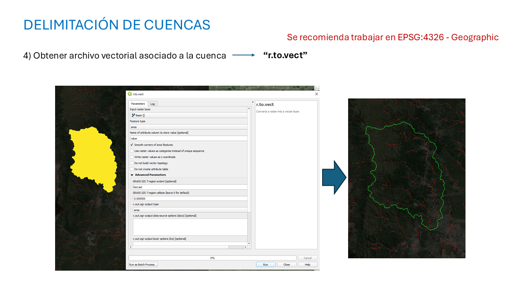
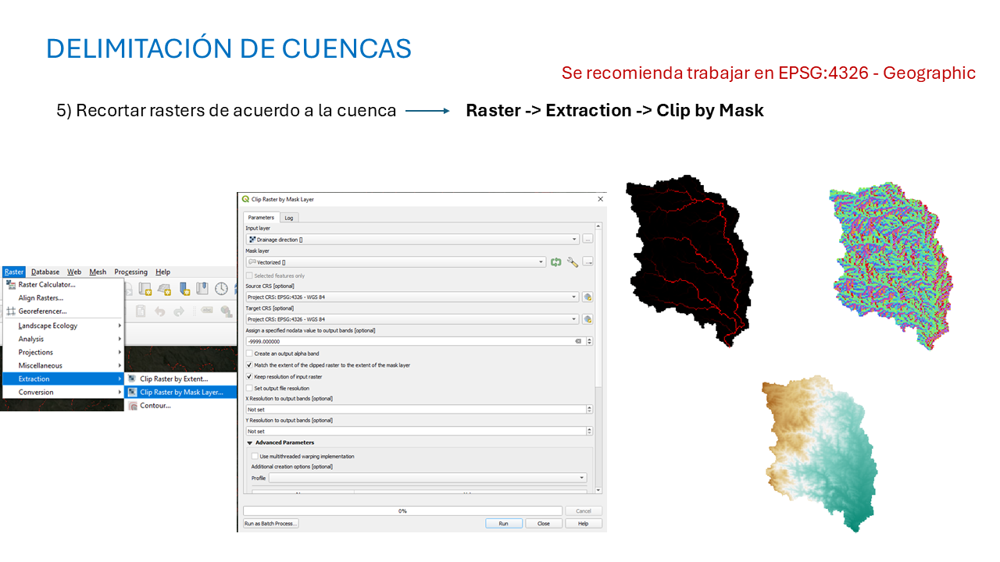

```{r setup, include=FALSE}
knitr::opts_chunk$set(echo = TRUE)

```


## Basin delimitation with DEM

### Open data and r.fill.dir tool

Open the version of QGIS called "QGIS Desktop with GRASS". First, the DEM file in tif format must be opened. Then the correction of imperfection in the image should be resolved with the *'r.fill.dir'* tool. Look for the tool in the Processing Toolbox of QGIS and look for *'r.fill.dir'*:
```{r, message = FALSE, echo = FALSE, warning = FALSE, out.width = "100%", out.height = "50%"}

```

**It is always recommended to work in EPSG:4326 projection.** Select the original DEM in the window that opens and run the tool with the Run button. This action will generate three differents images.

### r.watershed tool

After first tool, look for *'r.watershed tool'* in the Processing Toolbox and select the DEM corrected (DEM sin depresiones in spanish or Depresionless DEM in english) in previous step. In the 'Minimum size of exterior watershed basin' option change the value to 30 and click on the 'Enable Single Flow Direction'. After all this, run the tool with the Run button.
```{r, message = FALSE, echo = FALSE, warning = FALSE, out.width = "100%", out.height = "50%"}

```

This process generates lot of images. However, the most important ones will be Drainage Direction and Raster Accumulation.

### r.water.outlet tool

In this part of the process we will delimit the basin based on the closure point that we select from the drainage network. We will use the *'r.water.outlet'* tool from the Processing Toolbox. The Drainage Direction image should be choose as input and in 'Coordinates of outlet point' click on the three points and choose a location from the Raster Accumulation map in which the closure point will be set.
```{r, message = FALSE, echo = FALSE, warning = FALSE, out.width = "100%", out.height = "50%"}

```

This will generate the finally basin shape for that closure point.

### r.to.vect tool

This tool will convert the basin into a vector format to be able to overlay the basin with the drainage network
```{r, message = FALSE, echo = FALSE, warning = FALSE, out.width = "100%", out.height = "50%"}

```

Choose the basin as input and select the 'Smooth corners of area features' and run the tool with the Run button.

### Clip by Mask tool

Just to mask the different images to the basin delimitation use the Raster -> Extraction -> Clip by Mask option
```{r, message = FALSE, echo = FALSE, warning = FALSE, out.width = "100%", out.height = "50%"}

```