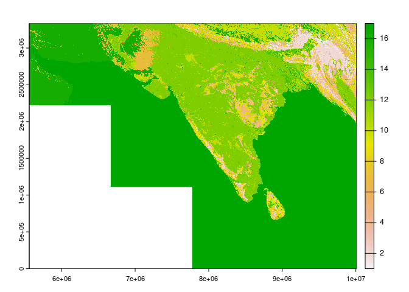
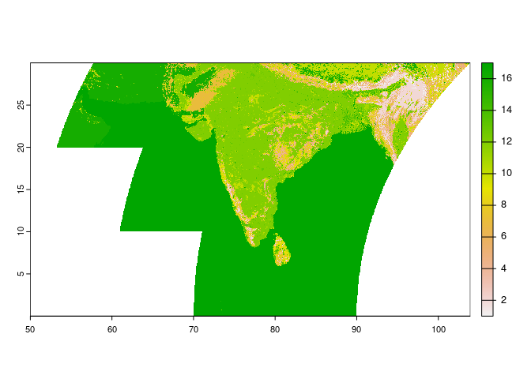

This is a post for presentation of specific MODIS products for India region


## Ploting MCD12Q1 MODIS Product

The data is available in data folder. First, open the data with terra
package

``` r
list.pathname <- list.files("./data", pattern = "hdf", full.names = TRUE)

data <- lapply(list.pathname, FUN = rast)
```

Now, creation of mosaic with each hdf.

``` r
data.mosaic <- mosaic(data[[1]], data[[2]], data[[3]], data[[4]], data[[5]], data[[6]], data[[7]], data[[8]], data[[9]])
```

    ## |---------|---------|---------|---------|=========================================                                          

Lastly, ploting of data with no change of projection, the numbers
represent soil type

``` r
plot(data.mosaic$LC_Type1)
```

<!-- -->

If the projection should be in longlat run:

``` r
data.mosaic.repro <- project(data.mosaic$LC_Type1, "+proj=longlat +datum=WGS84", method = "bilinear", progress = FALSE)
```

And plot again:

``` r
plot(data.mosaic.repro)
```

<!-- -->
