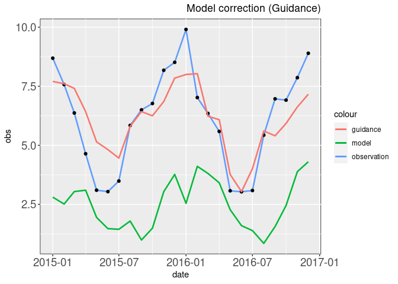
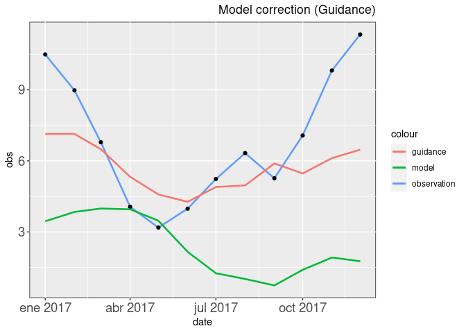

Post for calibration of soil model evaporation output


## Data preparation

First, the aws.wrfsmn library should be open:

``` r
library("aws.wrfsmn")
```

The example data to use will be ‘eva’ and can be visualize:

``` r
options(width = 200)
head(eva)
```

    ##        Dates evapo_obs OUT_PREC OUT_EVAP OUT_RUNOFF OUT_BASEFLOW OUT_SOIL_MOIST_lyr_1 OUT_EVAP_CANOP OUT_SURF_TEMP
    ## 1 2015-01-01       7.5    2.829   1.6771     0.3699       0.0017              25.2455         0.0000       29.8297
    ## 2 2015-01-02      10.5    0.065   1.2188     0.0000       0.0017              24.8014         0.2505       22.5682
    ## 3 2015-01-03       6.8    0.000   1.4352     0.0000       0.0017              24.2769         0.0000       25.3413
    ## 4 2015-01-04       6.7    1.107   1.3349     0.1247       0.0017              24.5836         0.0000       27.9340
    ## 5 2015-01-05       6.6    0.165   1.8848     0.0000       0.0017              24.0370         0.3505       29.7361
    ## 6 2015-01-06      11.1    0.000   1.7053     0.0000       0.0017              23.4706         0.0000       31.6070

The data has several columns with different hydrometeorological
variables, for example: precipitation, evaporation, runoff, soil
moisture, etc. All these variables are obtained from the VIC (Variable
Infiltration Capacity,
<https://vic.readthedocs.io/en/master/Overview/ModelOverview/>) soil
model, except for the ‘evapo_obs’ column, which represents the observed
data of evaporation for the same location. The data goes from 2015-01-01
to 2017-12-31.

## Definition of predictors variables

The variables chosen for adjustment can be any of those modeled. Here
they will be:

``` r
predictors.variables <- c('OUT_PREC', 'OUT_EVAP', 'OUT_RUNOFF', 'OUT_BASEFLOW',
                          'OUT_SOIL_MOIST_lyr_1', 'OUT_SURF_TEMP')
```

There is no limit on which variables to take, they could be more or less
depending on what the user wants.

## Definition of parameters of the Multiple Linear Regression

The data now will be trained with the 2015-01-01 to 2016-12-31 period
using ‘multiple.guidance’ function with the *predictors.variables*
vector:

``` r
data <- eva
data.training <- data[1:which(data$Dates == "2016-12-31"),]

ml.model <- multiple.guidance(input.data = data.training,
                              predictand = 'evapo_obs',
                              predictors = predictors.variables)
ml.model$coefficients
```

    ##          (Intercept)             OUT_PREC             OUT_EVAP           OUT_RUNOFF         OUT_BASEFLOW OUT_SOIL_MOIST_lyr_1        OUT_SURF_TEMP 
    ##           2.94132868          -0.02036946           0.37819395           0.47251876        -321.88820817          -0.14847134           0.28967937

Now, the parameters can be used to evaluate the model in any dataset.
Here it is applied to the same training period:

``` r
train.eval <- mg.evaluation(input.data = data.training, predictand = 'evapo_obs',
                            predictors = predictors.variables,
                            var.model = 'OUT_EVAP',
                            lmodel = ml.model)
```

The second element of the list has the statistics parameters of the
calibration:

``` r
train.eval[[2]]
```

    ##              rmse       nash      corr        KGE
    ## Model    5.003285 -1.0813490 0.2896406 0.01227294
    ## Guidance 2.839184  0.3297737 0.5742593 0.39791170

And the plot can be visualize with ‘ploting’ function, but first the
monthly data is calculated (for better visualization) with
‘daily2monthly’ function:

``` r
ploting(daily2monthly(data = train.eval[[1]]))
```

<!-- -->

## Calibration of evaporation soil model output for a verification dataset

The parameters of the previous section now are applied to the
data.verification period. This period will be defined from 2017-01-01 to
2017-12-31. Then, the statistics parameters of the calibration in this
dataset are shown:

``` r
data.verification <- data[which(data$Dates == "2017-01-01"):which(data$Dates == "2017-12-31"),]

verif.eval <- mg.evaluation(input.data = data.verification, predictand = 'evapo_obs',
                            predictors = predictors.variables,
                            var.model = 'OUT_EVAP',
                            lmodel = ml.model)

verif.eval[[2]]
```

    ##              rmse       nash       corr        KGE
    ## Model    6.118006 -1.2593959 0.08312116 -0.1740334
    ## Guidance 3.703190  0.1722015 0.51803857  0.2039644

Finally, the monthly plot of this dataset is displayed below:

``` r
ploting(daily2monthly(data = verif.eval[[1]]))
```

<!-- -->
