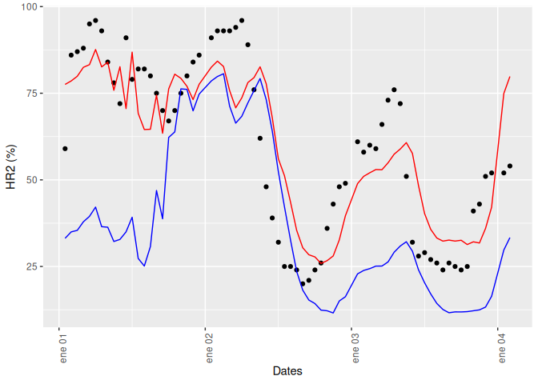
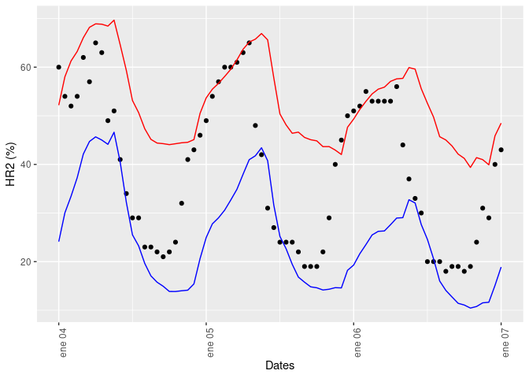

Post for calibration of relative humidity of WRF model


## Data download

First, the aws.wrfsmn and others libraries should be open:

``` r
library("aws.wrfsmn")
library("dplyr")
library("terra")
library("tibble")
library("ggplot2")
```

Then, some WRF filenames are defined from WRF SMN AWS service

``` r
filenames <- c()
for (i in c(1, 4))
  {aux.filenames <- get.wrf.files(year = 2023, month = 1, day = i, cycle = 00, time = "01H")
   filenames <- c(filenames, aux.filenames)
  }
print(filenames[1:13])
```

    ##  [1] "DATA/WRF/DET/2023/01/01/00/WRFDETAR_01H_20230101_00_000.nc"
    ##  [2] "DATA/WRF/DET/2023/01/01/00/WRFDETAR_01H_20230101_00_001.nc"
    ##  [3] "DATA/WRF/DET/2023/01/01/00/WRFDETAR_01H_20230101_00_002.nc"
    ##  [4] "DATA/WRF/DET/2023/01/01/00/WRFDETAR_01H_20230101_00_003.nc"
    ##  [5] "DATA/WRF/DET/2023/01/01/00/WRFDETAR_01H_20230101_00_004.nc"
    ##  [6] "DATA/WRF/DET/2023/01/01/00/WRFDETAR_01H_20230101_00_005.nc"
    ##  [7] "DATA/WRF/DET/2023/01/01/00/WRFDETAR_01H_20230101_00_006.nc"
    ##  [8] "DATA/WRF/DET/2023/01/01/00/WRFDETAR_01H_20230101_00_007.nc"
    ##  [9] "DATA/WRF/DET/2023/01/01/00/WRFDETAR_01H_20230101_00_008.nc"
    ## [10] "DATA/WRF/DET/2023/01/01/00/WRFDETAR_01H_20230101_00_009.nc"
    ## [11] "DATA/WRF/DET/2023/01/01/00/WRFDETAR_01H_20230101_00_010.nc"
    ## [12] "DATA/WRF/DET/2023/01/01/00/WRFDETAR_01H_20230101_00_011.nc"
    ## [13] "DATA/WRF/DET/2023/01/01/00/WRFDETAR_01H_20230101_00_012.nc"

The data of WRF model is downloaded from AWS
(<https://registry.opendata.aws/smn-ar-wrf-dataset/>). The documentation
of this dataset can be obtained from:
<https://odp-aws-smn.github.io/documentation_wrf_det/>.

Finally the dataset is downloaded from the ‘filenames’ variable:

``` r
wrf.download(wrf.name = filenames)
```

After this line, the dataset defined in ‘filenames’ will be downloaded.

## Definition of predictors variables

The variables for the adjustment can be any of those found in the WRF
dataset. Here would be:

``` r
variables <- rast("./_includes/WRFDETAR_01H_20230101_00_000.nc") %>% names()
print(variables)
```

    ##  [1] "PP"          "T2"          "PSFC"        "TSLB"        "SMOIS"      
    ##  [6] "ACLWDNB"     "ACLWUPB"     "ACSWDNB"     "HR2"         "dirViento10"
    ## [11] "magViento10"

The definition of each variable can be obtained from:
<https://odp-aws-smn.github.io/documentation_wrf_det/Formato_de_datos/>.
In this case the T2, HR2, SMOIS and magViento10 will be the variables to
use for the calibration of the Relative Humidity (but other combinations
of variables could be a better fit).

The nc files are open with the terra package and separated in each
variable:

``` r
files <- list.files(path = "./_includes", pattern = "nc", full.names = TRUE)
nc.files <- rast(files)

T2 <- nc.files[[which(names(nc.files) == "T2")]]
HR2 <- nc.files[[which(names(nc.files) == "HR2")]]
SMOIS <- nc.files[[which(names(nc.files) == "SMOIS")]]
magViento10 <- nc.files[[which(names(nc.files) == "magViento10")]]
```

Before extraction of data by location point, the transformation of the
reference coordinate system should be done:

``` r
T2 <- project(T2, "+proj=longlat +datum=WGS84", method = "bilinear")
HR2 <- project(HR2, "+proj=longlat +datum=WGS84", method = "bilinear")
SMOIS <- project(SMOIS, "+proj=longlat +datum=WGS84", method = "bilinear")
magViento10 <- project(magViento10, "+proj=longlat +datum=WGS84", method = "bilinear")
```

The location in which will try to calibrate the WRF model will be
Sunchales City, in the center of Argentina, the location of this city
is:

``` r
LON <- -61.53258
LAT <- -30.95686
```

Now, the temporal series of each variable are taken in that location:

``` r
T2.ts <- extract(T2, vect(cbind(LON, LAT)), ID = FALSE)
HR2.ts <- extract(HR2, vect(cbind(LON, LAT)), ID = FALSE)
SMOIS.ts <- extract(SMOIS, vect(cbind(LON, LAT)), ID = FALSE)
magViento.ts <- extract(magViento10, vect(cbind(LON, LAT)), ID = FALSE)
```

Now the data is arranged in a table with the Date information as first
column:

``` r
data.table <- tibble(Date = time(T2),
                     T2.wrf = t(T2.ts),
                     HR2.wrf = t(HR2.ts),
                     SMOIS.wrf = t(SMOIS.ts),
                     magViento.wrf = t(magViento.ts))
data.table
```

    ## # A tibble: 146 × 5
    ##    Date                T2.wrf[,1] HR2.wrf[,1] SMOIS.wrf[,1] magViento.wrf[,1]
    ##    <dttm>                   <dbl>       <dbl>         <dbl>             <dbl>
    ##  1 2023-01-01 00:00:00       31.2        28.0         0.131              1.85
    ##  2 2023-01-01 01:00:00       30.1        32.7         0.131              1.97
    ##  3 2023-01-01 02:00:00       27.9        34.7         0.131              3.12
    ##  4 2023-01-01 03:00:00       26.8        35.5         0.131              3.20
    ##  5 2023-01-01 04:00:00       25.7        38.0         0.131              3.26
    ##  6 2023-01-01 05:00:00       24.7        39.5         0.131              3.75
    ##  7 2023-01-01 06:00:00       23.2        42.1         0.131              3.33
    ##  8 2023-01-01 07:00:00       24.7        36.2         0.131              3.43
    ##  9 2023-01-01 08:00:00       24.8        35.6         0.131              2.97
    ## 10 2023-01-01 09:00:00       25.3        32.7         0.131              4.40
    ## # ℹ 136 more rows

## Predicting variable: observational data

The variable to predict, will be the relative humidity observed in
Sunchales City. Here is a sample of the data:

``` r
data.obs <- read.csv("./data/sunchales.csv", header = TRUE) %>% as_tibble()
data.obs
```

    ## # A tibble: 145 × 4
    ##    ESTACION FECHAUTC    HORA HUMREL
    ##       <int> <chr>      <int>  <int>
    ##  1    18250 2023-01-01     0     35
    ##  2    18250 2023-01-01     1     59
    ##  3    18250 2023-01-01     2     86
    ##  4    18250 2023-01-01     3     87
    ##  5    18250 2023-01-01     4     88
    ##  6    18250 2023-01-01     5     95
    ##  7    18250 2023-01-01     6     96
    ##  8    18250 2023-01-01     7     93
    ##  9    18250 2023-01-01     8     84
    ## 10    18250 2023-01-01     9     78
    ## # ℹ 135 more rows

The relative humidity observed can be found in the last column. Now the
data.obs is append next to the data.table:

``` r
data.table <- cbind(data.table, c(data.obs$HUMREL[1:73], data.obs$HUMREL[73:145]))
colnames(data.table) <- c("Dates", "T2.wrf", "HR2.wrf", "SMOIS.wrf", "magViento.wrf", "HR2.obs")
```

## Relative humidity calibration: Training

The data now will be trained with the 2023-01-01 00:00:00 to 2023-01-03
23:00:00 period using ‘multiple.guidance’ function with the predictors
variables defined with T2.wrf, HR2.wrf, SMOIS.wrf and magViento.wrf:

``` r
train.position <- which(data.table$Date == as.POSIXct("2023-01-04 00:00:00", tz = "UTC"))[1]

data.training <- data.table[1:train.position, ]

ml.model <- multiple.guidance(input.data = data.training,
                              predictand = 'HR2.obs',
                              predictors = c('T2.wrf', 'HR2.wrf', 'magViento.wrf'))
ml.model$coefficients
```

    ##   (Intercept)        T2.wrf       HR2.wrf magViento.wrf 
    ##    45.4171667    -0.1404637     0.6692733    -1.9627265

Now, the parameters can be used to evaluate the model in any dataset.
Here it is applied to the same training period:

``` r
train.eval <- mg.evaluation(input.data = data.training,
                            predictand = 'HR2.obs',
                            predictors = c('T2.wrf', 'HR2.wrf', 'magViento.wrf'),
                            var.model = 'HR2.wrf',
                            lmodel = ml.model)
```

The plot can not be visualize with ‘ploting’ function, because this
function only works with daily data, in this case the data is hourly.
So, the ggplot function will be use to visualize the results:

``` r
data.to.plot <- as_tibble(train.eval[[1]])
data.to.plot$Dates <- as.POSIXct(data.to.plot$Dates, format = "%Y-%m-%d %H:%M:%S")
data.to.plot$observation <- as.numeric(data.to.plot$observation)
data.to.plot$model <- as.numeric(data.to.plot$model)
data.to.plot$guidance <- as.numeric(data.to.plot$guidance)

figure <- ggplot(data = data.to.plot) +
  geom_point(aes(Dates, observation), col = "black") +
  geom_line(aes(Dates, model), col = "blue") +
  geom_line(aes(Dates, guidance), col = "red") +
  theme(axis.text.x = element_text(angle = 90, hjust = 1)) +
  labs(y = "HR2 (%)")

print(figure)
```

<!-- -->

The second element of the list ‘train.eval’ has the statistics
parameters of the calibration:

``` r
train.eval[[2]]
```

    ##              rmse       nash      corr       KGE
    ## Model    30.95942 -0.5371613 0.6151989 0.2966380
    ## Guidance 19.49197  0.3906803 0.6250442 0.4697325

## Relative humidity calibration: Verification

Now, the verification dataset is created

``` r
verif.position <- which(data.table$Date == as.POSIXct("2023-01-04 00:00:00", tz = "UTC"))[2]
data.verification <- data.table[verif.position:nrow(data.table), ]
```

The verification dataset is evaluated with the model created before with
the training dataset

``` r
verif.eval <- mg.evaluation(input.data = data.verification,
                            predictand = 'HR2.obs',
                            predictors = c('T2.wrf', 'HR2.wrf', 'magViento.wrf'),
                            var.model = 'HR2.wrf',
                            lmodel = ml.model)
verif.eval[[2]]
```

    ##              rmse       nash      corr       KGE
    ## Model    18.23736 -0.4257539 0.6623169 0.4960543
    ## Guidance 17.76432 -0.3527515 0.6900867 0.2518528

Finally, the plot of the verification dataset is display

``` r
data.to.plot <- as_tibble(verif.eval[[1]])
data.to.plot$Dates <- as.POSIXct(data.to.plot$Dates, format = "%Y-%m-%d %H:%M:%S")
data.to.plot$observation <- as.numeric(data.to.plot$observation)
data.to.plot$model <- as.numeric(data.to.plot$model)
data.to.plot$guidance <- as.numeric(data.to.plot$guidance)

figure <- ggplot(data = data.to.plot) +
  geom_point(aes(Dates, observation), col = "black") +
  geom_line(aes(Dates, model), col = "blue") +
  geom_line(aes(Dates, guidance), col = "red") +
  theme(axis.text.x = element_text(angle = 90, hjust = 1)) +
  labs(y = "HR2 (%)")

print(figure)
```

<!-- -->

It is important to detect that the maximums are better represented after
the calibration but the minimums are not. To have a more reliable
calibration of the variable relative humidity, it should be trained with
a greater amount of data.
